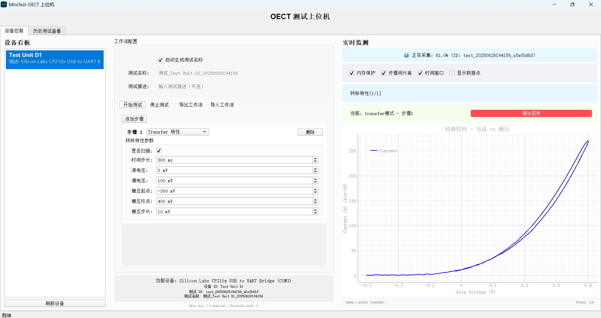

# MiniTest-OECT 安装与使用指南
> 欢迎使用MiniTest-OECT有机电化学晶体管测试系统！本指南将帮助您快速完成软件安装并开始使用。
## 📋 系统要求

### 硬件要求
- **操作系统**: Windows 10 或更高版本
- **内存**: 4GB RAM（推荐8GB或更多）
- **存储空间**: 至少1GB可用磁盘空间
- **USB接口**: 至少1个可用USB接口（用于连接测试设备）
- **显示器**: 分辨率1280×800或更高
### 测试设备要求
- OECT测试单元
- USB转串口数据线（通常使用CP210x芯片）
- OECT测试样品和电极连接（夹具）
## 🔧 安装步骤
### 第一步：安装USB转串口驱动程序
> ⚠️ **重要提示**: 必须先安装驱动程序，否则无法识别测试设备！
1. **下载驱动程序**
    - 从提供的驱动程序包中找到 `CP210x_Universal_Windows_Driver.zip`
    - 解压缩文件到桌面或任意文件夹
2. **安装驱动程序**
    - 进入解压后的文件夹
    - 右键点击 `silabser.inf` 文件
    - 选择"安装"
    - 按照安装向导完成安装
3. **验证驱动安装**
    - 连接测试设备到电脑
    - 打开"设备管理器"（Win+X，选择设备管理器）
    - 在"端口(COM和LPT)"下应该看到类似"Silicon Labs CP210x USB to UART Bridge (COM3)"的设备
### 第二步：安装MiniTest-OECT软件
1. **获取软件**
    - 从提供的软件包中找到 `MiniTest-OECT.exe`
    - 建议将其复制到专门的文件夹，如 `C:\MiniTest-OECT\`
2. **运行软件**
    - 双击 `MiniTest-OECT.exe` 启动程序
    - 首次运行时，系统会自动创建必要的文件夹：
        - `logs\` - 存储系统日志
        - `UserData\AutoSave\` - 存储测试数据
3. **防火墙和杀毒软件**
    - 如果Windows防火墙或杀毒软件提示，请选择"允许访问"
    - 软件需要创建多个后台进程用于数据处理
## 🚀 快速开始使用
### 连接设备
1. **物理连接**
    - 将OECT测试单元通过USB数据线连接到电脑
    - 确保设备电源正常
    - 正确连接测试样品和电极
2. **软件识别**
    - 启动MiniTest-OECT软件
    - 在左侧"设备看板"中点击"刷新设备"
    - 软件会自动扫描并显示可用设备
### 进行第一次测试

#### 1. 选择设备
- 在设备列表中点击选择您的测试设备
- 设备信息会显示在中间的"当前设备"区域
#### 2. 配置测试参数
**转移特性测试**（推荐新手从此开始）：
- 保持默认的"Transfer 特性"选择
- 设置测试参数：
    - **是否扫描**: ✓（推荐开启）
    - **时间步长**: 300 ms
    - **源电压**: 0 mV
    - **漏电压**: 100 mV
    - **栅压起点**: -300 mV
    - **栅压终点**: 600 mV
    - **栅压步长**: 10 mV
#### 3. 启动测试
- 在"测试名称"框中输入测试名称（或使用自动生成）
- 点击"开始测试"按钮
- 右侧"实时监测"区域会开始显示实时数据图表
#### 4. 观察测试进展
- 观察实时图表中的电流-电压曲线
- 顶部显示测试进度百分比
- 测试完成后图表会停止更新
#### 5. 停止测试
- 测试会自动完成，或者
- 随时点击"停止测试"按钮手动停止
### 查看测试结果
1. **切换到历史查看**
    - 点击顶部"历史测试查看"标签页
2. **浏览测试数据**
    - 顶部显示设备列表，选择您的设备
    - 左侧显示该设备的所有测试记录
    - 中间显示该测试记录下的所有测试步骤
    - 点击测试记录和测试步骤查看详细信息
3. **分析数据**
    - 右侧显示测试数据图表
    - "详情"标签页显示测试参数和统计信息
    - 可以查看每个步骤的详细参数
## 📊 测试类型说明
### Transfer 特性测试
- **用途**: 测量栅极电压对漏极电流的影响
- **图表**: 电流 vs 栅极电压
- **典型用途**: 分析器件的开关特性和阈值电压等
### Transient 特性测试
- **用途**: 测量器件的时间响应特性
- **图表**: 电流 vs 时间
- **典型用途**: 分析器件的响应速度和稳定性等
### Output 特性测试
- **用途**: 在不同栅极电压下测量输出特性
- **图表**: 多条电流 vs 漏极电压曲线
- **典型用途**: 全面分析器件的输出特性族
## 🔧 高级功能
### 工作流编排
1. **添加多个测试步骤**
    - 点击"添加步骤"创建复杂的测试序列
    - 支持Transfer、Transient、Output测试的组合
2. **循环测试**
    - 选择"循环"类型
    - 设置循环次数
    - 在循环内添加子步骤
3. **导入/导出工作流**
    - 使用工具栏的导入/导出功能
    - 保存常用的测试配置
### 数据管理
1. **批量操作**
    - 在历史查看页面按住Ctrl多选测试
    - 批量导出或删除测试数据
2. **数据导出**
    - 选择测试后点击"导出所选"
    - 数据以CSV格式保存，可用Excel等软件打开
## ❓ 常见问题解答
### Q: 软件启动失败或报错
**A: 检查以下项目**
- 确保程序所在文件夹的属性中的“安全”选项卡里给足了权限
- 尝试以管理员权限运行（右键"以管理员身份运行"）
- 检查是否安装了最新的Visual C++运行库
- 检查Windows防火墙是否阻止了程序
### Q: 找不到设备或COM端口
**A: 解决步骤**
1. 确认USB线连接正常
2. 检查设备管理器中是否有CP210x设备
3. 如果显示黄色感叹号，重新安装驱动程序
4. 尝试更换USB端口
### Q: 测试数据异常或无数据
**A: 检查项目**
- 确认设备电源正常
- 检查电极连接是否良好
- 验证测试参数设置是否合理
- 查看日志文件了解详细错误信息
### Q: 软件运行缓慢
**A: 优化建议**
- 关闭不必要的其他软件
- 在实时监测中启用"内存保护"选项
- 适当增加"时间步长"参数
- 确保有足够的磁盘空间
### Q: 如何备份测试数据
**A: 数据位置**
- 所有测试数据存储在 `UserData\AutoSave\` 文件夹下
- 按设备ID和时间戳组织
- 可以直接复制整个文件夹进行备份
- 或使用软件的批量导出功能
## 📞 技术支持
如果遇到问题：
1. **查看日志文件**: `logs\` 文件夹中的日志文件包含详细的错误信息
2. **检查README.md**: 查看完整的 `README.md` 了解项目详情
3. **联系技术支持**: lidonghao100@outlook.com
## 📝 使用小贴士
- **保存重要数据**: 定期备份测试数据到外部存储
- **参数记录**: 为每次测试添加描述，方便后续查找
- **设备保养**: 保持设备清洁，定期检查连接线
- **软件更新**: 定期检查是否有软件更新版本
---
**祝您使用愉快！** 🎉
_如果本指南对您有帮助，请妥善保存以备日后参考。_